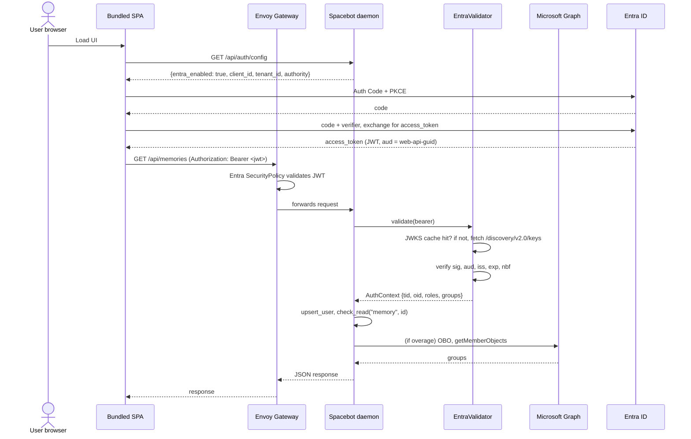

# Entra ID Authentication: Architecture Diagram

How a request flows from the browser through Entra to a Spacebot daemon handler. Companion reference for SOC 2 evidence packages, paired with `entra-app-registrations.md` (the three app registrations) and `entra-audit-log.md` (the post-decision audit trail).

## End-to-end auth flow (hosted K8s)

## Token storage by surface

| Surface | Storage | Revocation on logout |
|---|---|---|
| SPA in browser | MSAL.js `cacheLocation: "memoryStorage"` (per A-16) | Instant on tab close |
| SPA in Tauri | Daemon `SecretsStore` (`secrets.redb`) via loopback `POST`/`GET`/`DELETE /api/desktop/tokens` (Phase 8) | `MsalProvider.logoutRedirect` + daemon `DELETE` |
| CLI | Operator-local flat file at `directories::ProjectDirs::data_dir().join("cli-tokens.json")`, mode 0600 on POSIX (Phase 9, STORE-D) | `spacebot entra logout` |
| Service principal (CI) | Env var, short-lived | N/A, never cached |

## Defense-in-depth layers

1. **Gateway:** Envoy SecurityPolicy validates the JWT at the cluster edge. Bad tokens never reach the daemon.
2. **Daemon middleware:** `entra_auth_middleware` revalidates the token. A mismatched audience or issuer fails here even if the gateway happened to pass.
3. **Handler authz:** `check_read` / `check_write` consult `resource_ownership` + `team_memberships`. Role-only assertions like `require_role(&ctx, ROLE_ADMIN)` gate admin endpoints.
4. **Audit:** every allow and deny decision lands in `audit_events`. The chain (`prev_hash` / `row_hash`) makes tampering detectable; the daily WORM export makes tampering recoverable.

## Key scope boundaries

- **`spacebot-web-api` registration:** owns the protected scope + app roles. Tokens land with `aud = api://spacebot-web-api/...`.
- **`spacebot-spa` registration:** holds SPA redirect URIs (browser + Tauri loopback). Acquires the scope on behalf of the user.
- **`cli` variant:** public client. Device code (humans) + client credentials (automation via `SPACEBOT_CLIENT_ID` + `SPACEBOT_CLIENT_SECRET`).

See `docs/design-docs/entra-app-registrations.md` for the full schema of all three (client IDs, app roles, redirect URIs, API permissions).

## Cross-references

- `docs/design-docs/entra-app-registrations.md`: Phase 1 app-registration schema.
- `docs/design-docs/entra-audit-log.md`: Phase 5 audit-event chain + WORM export.
- `docs/design-docs/entra-backfill-strategy.md`: Phase 2 no-auto-broadening policy + Phase 10 orphan-sweep.
- `docs/content/docs/(configuration)/entra-auth.mdx`: Phase 6 SPA operator guide.
- `docs/content/docs/(configuration)/cli-auth.mdx`: Phase 9 CLI operator guide.
